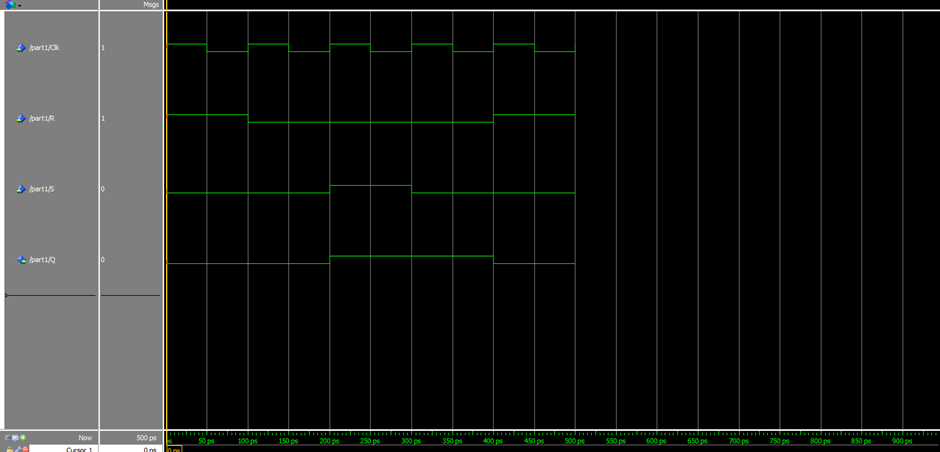
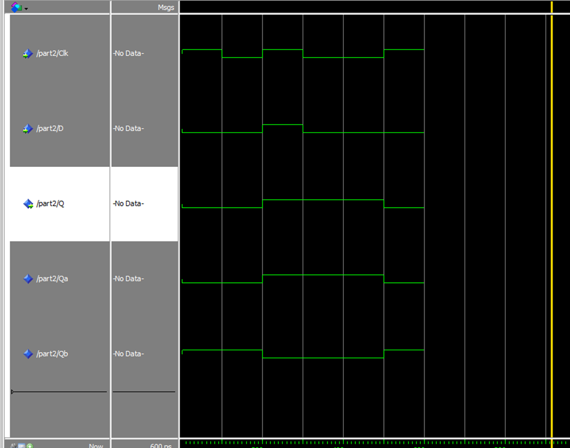
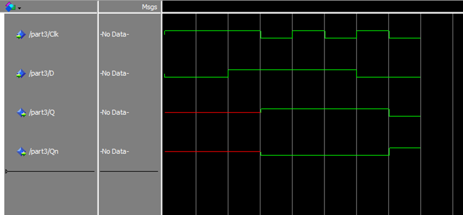
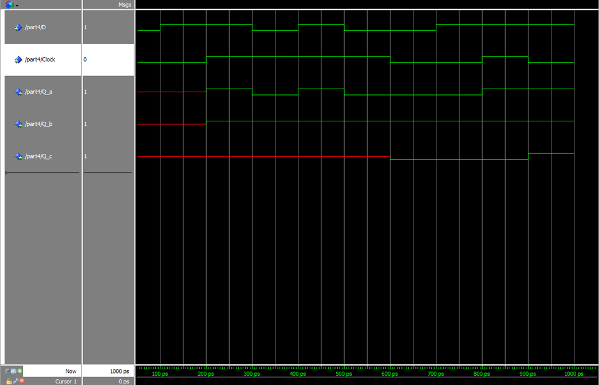

# SSC0108 - Prática Sistemas Digitais

[Projeto 1: Latches, Flip-flops, and Registers.](./lab3.pdf)

### ALUNOS

|        Nome                         |    NUSP   |       
|:-----------------------------------:|:---------:|  
|   Artur Domitti Camargo             |  15441661 |   
|   Lucas Mello Ciosaki       	      |  14591305 |   
|   Lucas Alves da Silva		         |  11819553  | 

### PART I

[RTL VIEWER FOR PART I](./part1.pdf)

[TECHNOLOGY MAP VIEWER FOR PART I](./part1tmv.pdf)

SIMULATION PART I

VHDL CODE

'''
LIBRARY ieee;
USE ieee.std_logic_1164.all;

ENTITY part1 IS
  PORT ( Clk, R, S : IN STD_LOGIC;
  Q : OUT STD_LOGIC);
END part1;

ARCHITECTURE Structural OF part1 IS
  SIGNAL R_g, S_g, Qa, Qb : STD_LOGIC ;
  ATTRIBUTE KEEP : BOOLEAN;
  ATTRIBUTE KEEP OF R_g, S_g, Qa, Qb : SIGNAL IS TRUE;
BEGIN
  R_g <= R AND Clk;
  S_g <= S AND Clk;
  Qa <= NOT (R_g OR Qb);
  Qb <= NOT (S_g OR Qa);
  Q <= Qa;
END Structural;
'''

### PART II

[RTL VIEWER FOR PART II](./part2.pdf)

[TECHNOLOGY MAP VIEWER FOR PART II](./part2tmv.pdf)

SIMULATION PART II

VHDL CODE 

LIBRARY ieee;
USE ieee.std_logic_1164.all;

ENTITY part2 IS
	PORT ( Clk, D : IN STD_LOGIC;
	Q : OUT STD_LOGIC);
END part2;

ARCHITECTURE Structural OF part2 IS
	SIGNAL R, S, R_g, S_g, Qa, Qb : STD_LOGIC ;
	ATTRIBUTE KEEP : BOOLEAN;
	ATTRIBUTE KEEP OF R, S, R_g, S_g, Qa, Qb : SIGNAL IS TRUE;
BEGIN

	S <= D;
	R <= NOT (D);
	S_g <= NOT (S AND Clk);
	R_g <= NOT (R AND Clk);
	Qa <= NOT (S_g AND Qb);
	Qb <= NOT (Qa AND R_g);
	
	Q <= Qa;
END Structural;

### PART III

[RTL VIEWER FOR PART II](./part3.pdf)

[TECHNOLOGY MAP VIEWER FOR PART II](./part3tmv.pdf)

SIMULATION PART III

VHDL CODE

LIBRARY ieee;
USE ieee.std_logic_1164.ALL;

ENTITY part3 IS
        PORT ( Clk, D : IN STD_LOGIC;
	Q, Qn : OUT STD_LOGIC);
END part3;

ARCHITECTURE Structural OF part3 IS
    SIGNAL Q_master, Q_slave, Qn_slave, Clk_not : STD_LOGIC;
    
    COMPONENT part2
        PORT ( Clk, D : IN STD_LOGIC;
	Q, Qn : OUT STD_LOGIC);
    END COMPONENT;

BEGIN

   
    Master_Latch: part2
        PORT MAP (
            Clk => Clk,            
            D   => D,                
            Q   => Q_master         
        );

    
    Slave_Latch: part2
        PORT MAP (
            Clk => Clk_not,          
            D   => Q_master,         
            Q   => Q_slave,          
            Qn  => Qn_slave          
        );

    
    Clk_not <= NOT Clk;
    Q <= Q_slave;
    Qn <= Qn_slave;
	 

END Structural;

### PART IV

[RTL VIEWER FOR PART II](./part4.pdf)

[TECHNOLOGY MAP VIEWER FOR PART II](./part4tmv.pdf)

SIMULATION PART IV

VHDL CODE
library IEEE;
use IEEE.STD_LOGIC_1164.ALL;

entity part4 is
    Port (
        D : in STD_LOGIC;
        Clock : in STD_LOGIC;
        Q_a : out STD_LOGIC;
        Q_b : out STD_LOGIC;
        Q_c : out STD_LOGIC
    );
end part4;

architecture Behavioral of part4 is

    signal Qa : STD_LOGIC;
    signal Qb : STD_LOGIC;
    signal Qc : STD_LOGIC;

begin

    -- D LATCH
    process (D, Clock)
    begin
        if (Clock = '1') then
            Qa <= D;
        end if;
    end process;

    -- POSITIVE FF
    process (Clock)
    begin
        if rising_edge(Clock) then
            Qb <= D;
        end if;
    end process;

    -- NEGATIVE FF
    process (Clock)
    begin
        if falling_edge(Clock) then
            Qc <= D;
        end if;
    end process;

    Q_a <= Qa;
    Q_b <= Qb;
    Q_c <= Qc;

end Behavioral;

